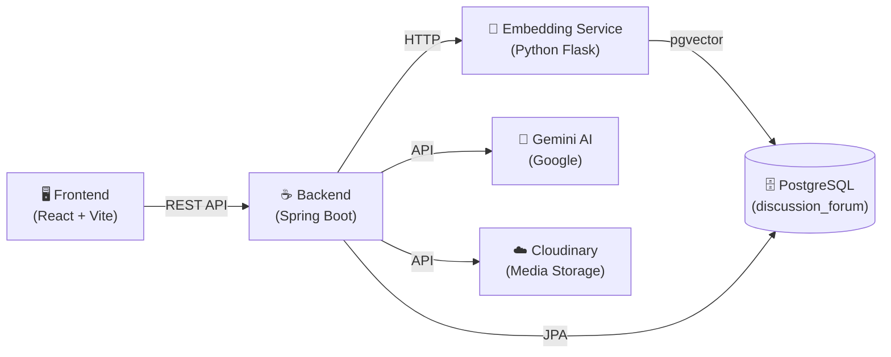
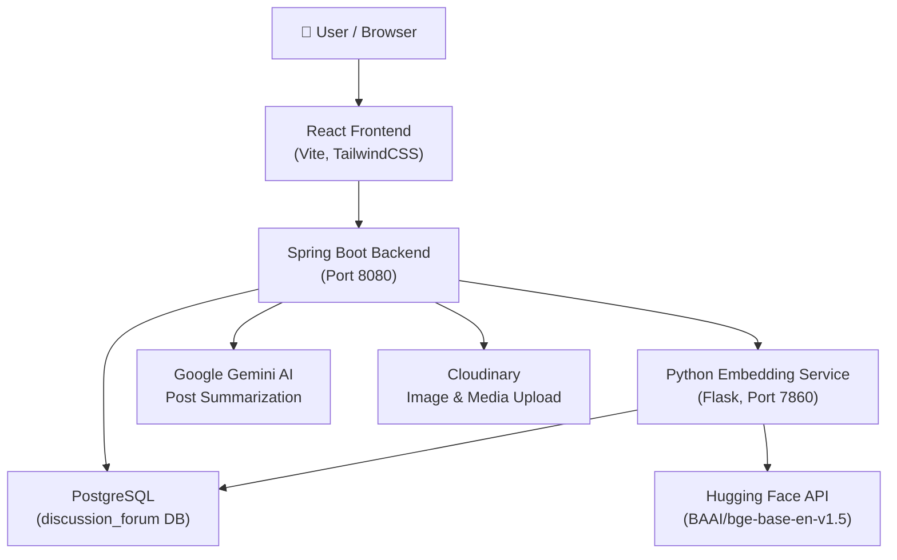
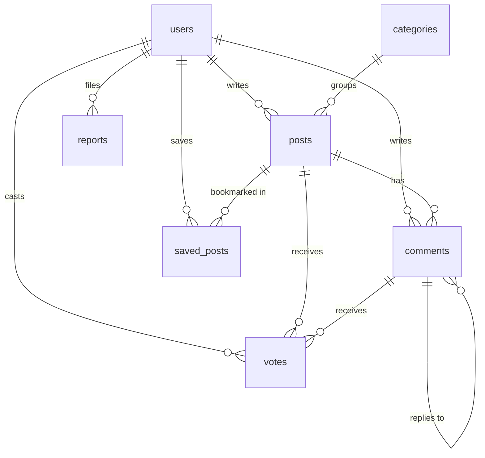
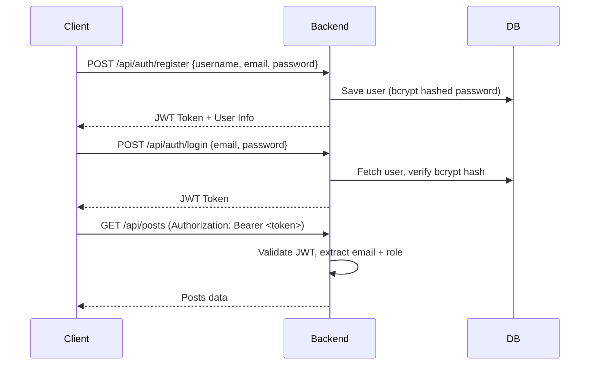
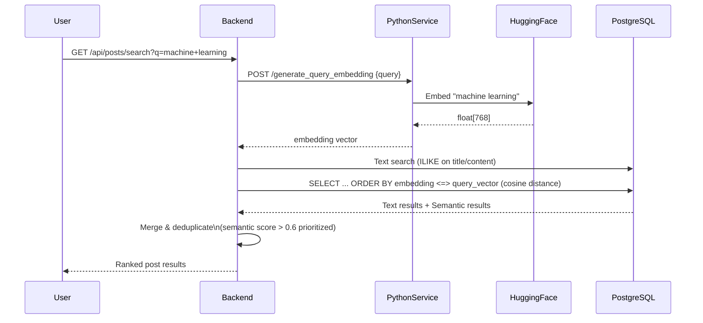

# gemini-chatbot-with-tools
A practical project showing how to build essential tools (like email integration, SQL operations, web search, YouTube transcripts) for AI agents — not just the agent itself.

# 💬 Gemini 2.0 Flash Chatbot (with Real-World Tool Integration)

This project is a console-based chatbot powered by Google's Gemini 2.0 Flash model.  
It integrates various tools like MySQL database operations, Google Search, Email operations, YouTube transcript extraction, and Web content fetching, enhancing the chat experience with real-world functionalities.

---

## 🛠 Tech Stack
- Python
- Google GenAI SDK (`google.generativeai`)
- MySQL
- SMTP & IMAP for Email
- REST APIs (YouTube Transcript API, Web Content API)
- dotenv

---

## 📂 Project Structure

| File | Description |
|:-----|:------------|
| `main.py` | Initializes the chatbot and handles user interaction. |
| `tools.py` | Collection of utility functions and database/email/YouTube tools. |
| `store_to_db.py` | Stores chat history into a MySQL database (`chats` database). |

Checkout the example files (basic implemantation files such as `ReadEmail.py` , `SendEmail.py` , and etc.,)

---

## ⚙️ Setup Instructions

### 1. Clone the repository:
```bash
git clone https://github.com/Shushanth101/gemini-chatbot-with-tools.git
cd gemini-chatbot-with-tools
```

### 2. Install the required packages:
```bash
pip install -r requirements.txt
```

### 3. Create a `.env` file with the following variables:
```ini
google_api_key_1=YOUR_GEMINI_API_KEY (get your gemini api key here ==> https://aistudio.google.com/app/apikey
EMAIL=your-email@gmail.com
APP_PASSWORD=your-app-password (setup your app password in gmail)
```

### 4. Set up MySQL databases:

- `store_db` for running SQL queries.
- `chats` database with a `chat_log` table:
```sql
CREATE DATABASE chats;
USE chats;
CREATE TABLE chat_log (
    id INT AUTO_INCREMENT PRIMARY KEY,
    role VARCHAR(255),
    content TEXT
);
```

---

## 🧩 Features

- 💬 Chat with Gemini 2.0 Flash Model
- 🔎 Google Search Retrieval
- 📧 Send and Read Emails
- 📝 Run SQL Queries on Local MySQL Database
- 🎥 Fetch YouTube Video Transcripts
- 🌐 Fetch Web Content
- 🗄️ Store Chat History into MySQL

---

## 🚀 How to Run
```bash
python main.py
```
- Start chatting!
- Type `e` or `exit` to end the session.

---

## 🙏 Acknowledgements

- Google GenAI
- YouTube Transcript API
- Jina.ai Web Reader API
---
Everyone talks about agents. This project teaches you how to actually build the real-world tools that make agents powerful — like reading emails, sending emails, running SQL queries, fetching YouTube transcripts, and more.

---


# 🎤 Discussion Forum — Presentation Notes

> **Stack:** Java Spring Boot · React (Vite) · PostgreSQL · Python Flask · pgvector · Gemini AI · Cloudinary

---

## 📌 Project Overview

A **full-stack Discussion Forum Web Application** that allows users to create posts, comment, vote, save content, and search — with AI-powered features like **semantic search** and **post summarization**.

The project is divided into **3 services**:



---

## 🏗️ Architecture Overview



---

## ⚙️ Tech Stack

### Backend
| Layer | Technology |
|---|---|
| Framework | Spring Boot 3.2.4 (Java 17) |
| ORM | Spring Data JPA + Hibernate |
| Security | Spring Security + JWT (JJWT 0.12.5) |
| Database | PostgreSQL + pgvector extension |
| Media Upload | Cloudinary SDK |
| AI Summarization | Google Gemini REST API |
| Build Tool | Maven |

### Frontend
| Layer | Technology |
|---|---|
| Framework | React 19 + Vite |
| Styling | TailwindCSS |
| Routing | React Router DOM v7 |
| HTTP Client | Axios |
| Markdown | @uiw/react-md-editor + react-markdown |
| Icons | react-icons |

### Embedding Microservice (Python)
| Layer | Technology |
|---|---|
| Web Framework | Flask |
| Embedding Model | Hugging Face `BAAI/bge-base-en-v1.5` (768-dim) |
| DB Driver | psycopg2 |
| Concurrency | ThreadPoolExecutor (2 workers) |

---

## 🔧 Backend Features

### 1. Authentication & Authorization
- **JWT-based stateless auth** — tokens generated on login/register
- **Role-based access control** — `USER` and `ADMIN` roles
- Passwords hashed with **BCrypt**
- Protected routes with Spring Security's `@PreAuthorize`
- Ban check on login — banned users are rejected at authentication level

### 2. Post Management (`/api/posts`)
- **CRUD** — Create, Read, Update, Delete posts
- Rich content support — Markdown via `TEXT` columns
- Optional **media URL** attachment (uploaded via Cloudinary)
- **View count** auto-incremented on every fetch
- **Pagination** on all list endpoints
- **Sorting** — `latest`, `oldest`, `trending`

### 3. Hybrid Semantic Search (`/api/posts/search`)
This is a standout feature. When you search:
1. It runs a **text-based SQL search** on title/content
2. It **simultaneously** requests a **vector embedding** (768-dim) from the Python service via Hugging Face API
3. It runs a **pgvector cosine similarity** query on stored embeddings
4. Results are **merged and deduped** — semantic results with score `> 0.6` are prioritized, text results are appended
5. Falls back gracefully to text-only search if the embedding service is unavailable

### 4. Trending & Unanswered Posts
- **Trending** — posts from last **7 days** ranked by upvotes + view count
- **Unanswered** — posts with **zero comments**, ranked by recency

### 5. Voting System (`/api/posts/{id}/vote`)
- `+1` = upvote, `-1` = downvote (stored in `votes` table)
- **Toggle behavior** — clicking the same vote again removes it
- **Vote switching** — switching from up to down adjusts both counters
- One vote per user per post/comment (DB-level unique constraint)
- Same system applies to **comments**

### 6. Save / Bookmark Posts (`/api/posts/{id}/save`)
- Users can bookmark posts
- Toggle save/unsave
- Unique constraint prevents duplicate saves
- `/api/posts/saved` endpoint returns all saved posts for a user

### 7. Nested Comments (`/api/posts/{id}/comments`)
- Full **threaded/nested reply** support via self-referential FK (`parent_comment_id`)
- Comments support voting (upvotes)
- Cascade delete — deleting a parent comment removes all replies

### 8. AI Post Summarization (`/api/posts/{id}/summary`)
- Authenticated users can request a **Gemini AI-generated summary** of any post + its comments
- Structured prompt sent to Gemini: overview → key arguments → conclusion
- Target: **200–300 words**
- Retry logic if summary is too short
- **Fallback URL** support if primary Gemini API fails

### 9. Media Upload (`/api/media`)
- Images/files uploaded to **Cloudinary**
- Max size: **10 MB** per file
- Returns a CDN URL stored in post's `media_url`

### 10. Reporting System (`/api/reports`)
- Users can report **Posts**, **Comments**, or **Users**
- Polymorphic design — single `reports` table handles all target types
- Captures: `target_title`, `target_author`, `reason`, `status`
- Report statuses: `PENDING` → `REVIEWED` / `DISMISSED`

### 11. Admin Panel (`/api/admin`)
- **Protected** — `ADMIN` role required for all endpoints
- Dashboard stats: total users, posts, comments, pending reports
- Ban / Unban / Delete users
- Delete any post or comment
- Create / Delete categories
- View & update report statuses
- **Re-embed all posts** — triggers embedding regeneration for semantic search repair

---

## 🐍 Embedding Microservice Features

- Built with **Flask** (Python), runs on port 7860
- Two endpoints:
  - `POST /process_post/<post_id>` — async embedding generation for a post
  - `POST /generate_query_embedding` — real-time embedding for a search query
- Uses **Hugging Face Inference API** (`BAAI/bge-base-en-v1.5`, 768 dimensions)
- Embeddings are **L2-normalized** before storage (cosine similarity ready)
- Runs embedding in a **thread pool** (non-blocking, instant HTTP response)
- Writes embedding directly to `posts.embedding` column via psycopg2

---

## 🖼️ Frontend Features

### Pages & Routes
| Route | Page | Access |
|---|---|---|
| `/` | Home | Public |
| `/login` | Login | Public |
| `/register` | Register | Public |
| `/post/:postId` | Post Detail | Public |
| `/create` | Create Post | Auth Required |
| `/dashboard` | User Dashboard | Auth Required |
| `/admin` | Admin Panel | ADMIN Role Only |

### Key UI Features
- **Lazy loading** — all pages loaded via `React.lazy` + `Suspense` (performance optimization)
- **Protected Routes** — `ProtectedRoute` and `AdminRoute` components for guard logic
- **AuthContext** — global auth state with JWT stored and shared across app
- **Markdown editor** — full markdown support for creating posts (`@uiw/react-md-editor`)
- **Markdown rendering** — rendered with code syntax highlighting (`react-syntax-highlighter`)
- **Rich home feed** — filter by category, sort (latest/trending/oldest), search bar
- **Post detail** — view count, votes, nested comments, bookmark, report, AI summary button
- **User dashboard** — profile info, own posts, saved posts, change password, upload avatar
- **Admin panel** — full user/post/comment/category/report management UI

---

## 🗄️ Database Design Highlights



**Design decisions worth noting:**
- All primary keys use **UUID** (except categories which use BIGSERIAL auto-increment)
- `posts.embedding` is a `vector(768)` column powered by **pgvector** extension
- `votes` has unique constraints on `(user_id, post_id)` and `(user_id, comment_id)` — DB-enforced one-vote-per-user
- `comments` is **self-referential** for nested replies
- `reports` is **polymorphic** — one table handles post, comment, and user reports
- **9 performance indexes** on frequently queried columns

---

## 🔐 Security Design



- JWT tokens contain: `email` (subject) + `role` (claim)
- Token expiry configurable via `JWT_EXPIRATION` env var (default: 24 hours)
- All sensitive config via **environment variables** (never hardcoded)

---

## 🔍 Semantic Search Deep Dive (Most Interesting Feature)



**Key points:**
- When a post is **created**, the embedding service is called **asynchronously**
- On **search**, query is embedded in real-time and compared via **cosine similarity**
- Semantic score threshold: `> 0.6` for high-relevance results
- Falls back to text-only if embedding service is unavailable

---

## ❓ Important Questions & Answers

### Architecture & Design

**Q: Why use a microservice for embeddings instead of a Java library?**
> The Hugging Face model (`BAAI/bge-base-en-v1.5`) is a Python-native ML model. Running it in a separate Python Flask service keeps the Java backend clean and allows independent scaling. On a free Render deployment, it also keeps memory usage isolated.

**Q: Why JWT instead of sessions?**
> JWT is stateless — no session storage needed on the server. Easier to scale horizontally and works well for a REST API consumed by a separate frontend.

**Q: Why PostgreSQL with pgvector instead of a dedicated vector DB like Pinecone?**
> pgvector allows storing both relational data and vector embeddings in the same database, simplifying infrastructure. It's sufficient for moderate scale and avoids managing a second external service.

**Q: What does the `UNIQUE(user_id, post_id)` constraint in the votes table achieve?**
> It enforces at the database level that a user can only cast one vote per post — preventing duplicate votes even if API requests are made simultaneously.

**Q: What happens if the embedding service is down?**
> The backend catches the exception gracefully, logs it, and falls back to text-only search. Post creation still succeeds — the embedding is just not generated. Admins can trigger a `/api/admin/reembed-all-posts` to re-generate all missing embeddings later.

### Backend Deep Dives

**Q: How does the vote toggle work?**
> If a user votes and the same vote type already exists in the `votes` table, the vote is removed (toggled off). If the vote type is different, it switches direction and adjusts both `upvotes` and `downvotes` counters atomically.

**Q: How does AI summarization work?**
> The backend collects the post content + up to 50 latest comments, formats them into a structured prompt, and sends it to the Google Gemini API. If the response is less than 200 characters, a retry is triggered with an instruction to provide more detail.

**Q: What is the trending algorithm?**
> Posts from the **last 7 days** ranked by `upvotes` and `view_count`. The query filters by `created_at > now() - 7 days` and orders by relevance score.

**Q: How are nested comments handled?**
> Comments have a `parent_comment_id` foreign key that references the same `comments` table. A `null` parent means it's a top-level comment. The JPA entity maps this via a `@ManyToOne` self-reference and a `@OneToMany replies` list.

**Q: How is the media upload handled?**
> Images are uploaded to **Cloudinary** via their Java SDK. The backend receives a file, uploads it, and returns the CDN URL which is then stored in the post's `media_url` field.

### Frontend Deep Dives

**Q: Why React.lazy and Suspense?**
> Code splitting — each page is loaded as a separate JS chunk only when the user navigates to it. This reduces the initial bundle size and speeds up the first load.

**Q: How is authentication state managed?**
> Using React Context (`AuthContext`). The JWT token is stored and the `isAuthenticated()` and `isAdmin()` helper functions are provided to all components. Route guards (`ProtectedRoute`, `AdminRoute`) use these helpers to control access.

**Q: How does Markdown work in posts?**
> Users write in Markdown using the `@uiw/react-md-editor` component. When displaying a post, `react-markdown` renders it with `react-syntax-highlighter` for code blocks and `remark-gfm` for GitHub-flavored Markdown tables, checkboxes, etc.

### Database Questions

**Q: Why UUID for primary keys instead of auto-increment integers?**
> UUIDs are globally unique, making them safe for distributed systems and preventing ID enumeration attacks (you can't guess `user_id=3` to scrape the API).

**Q: What is the `vector(768)` column?**
> It stores a 768-dimensional float array — the semantic embedding of a post's title + content. The `pgvector` extension allows efficient cosine similarity (`<=>` operator) queries on these vectors.

**Q: Why is `reports` designed polymorphically instead of separate tables per target type?**
> It keeps the schema simple and the admin review UI unified — one table, one query, regardless of whether the report is about a post, comment, or user.

---

## 🚀 Deployment Notes

- **Backend** → Dockerized (Dockerfile present), deployable to Render / Railway / Fly.io
- **Frontend** → `vercel.json` present, deployable to Vercel
- **Embedding Service** → Deployable to Render (free tier, Hugging Face API reduces memory usage vs local model)
- All secrets managed via `.env` file (`dotenv-java` on backend, Vite env on frontend)

---

## 📂 Project Structure Summary

```
discussion-forum/
├── backend/               # Spring Boot Java app
│   ├── src/main/java/com/forum/
│   │   ├── controller/    # REST API endpoints (9 controllers)
│   │   ├── service/       # Business logic (9 services)
│   │   ├── model/         # JPA entities (7 tables)
│   │   ├── repository/    # Spring Data JPA repos
│   │   ├── dto/           # Request/Response POJOs
│   │   └── config/        # Security, JWT, CORS config
│   ├── schema.sql         # Full DB schema with indexes
│   └── Dockerfile
├── frontend/              # React + Vite app
│   └── src/
│       ├── pages/         # 7 pages (Home, Post, Create, Dashboard, Admin...)
│       ├── components/    # Navbar
│       ├── AuthContext.jsx # Global auth state
│       └── api.js         # Axios instance
├── embeddingservice/      # Python Flask microservice
│   ├── main.py            # Flask server + HuggingFace embedding logic
│   └── db.py              # PostgreSQL connection
└── database-schema.md     # ERD + table specs
```

